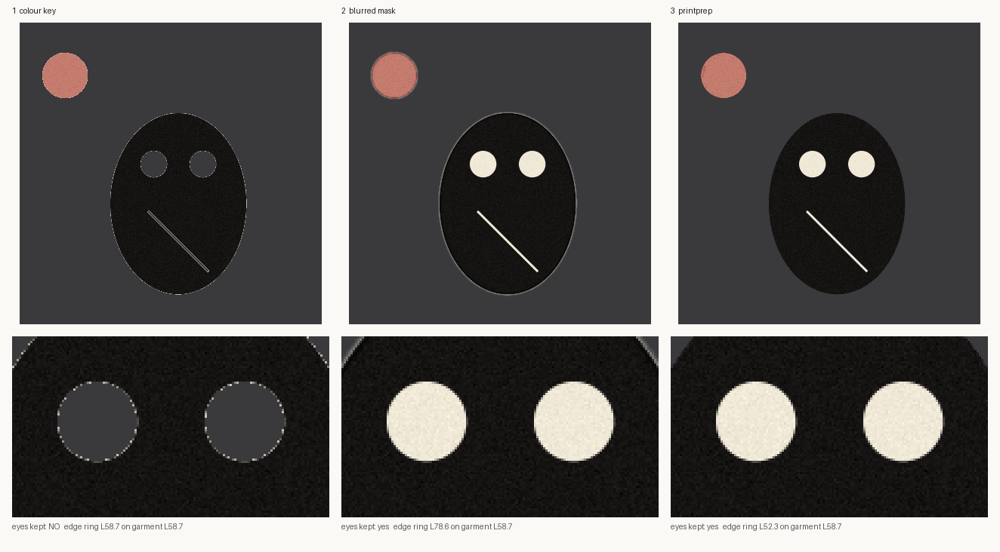

# printprep

Prepare finished artwork for garment printing: cut it off its background without halos or holes,
fit it to the print canvas without distortion, and measure the result instead of eyeballing it.



*Left: a colour key deletes the eyes, because they are the same cream as the paper. Middle: a
blurred mask keeps them but rings every shape in pale paper colour. Right: printprep. Reproduce it
with `python examples/halo_demo.py`.*

## Why

Print-on-demand artwork usually arrives on a background: a scan on paper, a generated image on a
flat colour, a poster with a border. Getting from there to a transparent 4500 x 5400 print file
fails in a few specific, repeatable ways:

- **Holes.** The background colour also appears *inside* the design: the whites of an eye, a
  highlight, a hairline gap. A colour key makes them transparent and the shirt shows through.
- **Halos.** A softened cut edge still carries some of the background colour. It is invisible on
  the colour the artwork was drawn on, and a pale ring on every dark garment.
- **Stretching.** Resizing to a target width *and* height quietly distorts anything that is not
  already the canvas shape.
- **Invisible failures.** Many viewers draw transparency as black, so a design that was never cut
  out can look fine, and a clean one can look broken.

printprep is a small library and command line built around one rule for each of those.

| Measured on the demo artwork, composited on a dark garment (L58.7) | eyes kept | 1px edge ring |
|---|---|---|
| Colour key | no | L58.7, hard stair-stepped edge |
| Blurred connectivity mask | yes | **L78.6**, a visible pale fringe |
| `printprep.key_ground` | yes | **L52.3**, the edge takes on the ink |

## Install

```bash
pip install git+https://github.com/daveatpressac-lab/printprep
```

Python 3.9+, with numpy, scipy, OpenCV (headless) and Pillow. No network access, no models.

## Quick start

```python
from PIL import Image
from printprep import key_ground, fit_to_canvas, save_master, check_master, halo

art = Image.open("drawing_on_paper.png")

cut = key_ground(art)                    # transparent background, enclosed cream kept
print(cut.stats)                         # ground colour, % transparent, enclosed px kept
print(halo(cut.image))                   # edge ring vs a dark garment - lower is cleaner

master = fit_to_canvas(cut.image)        # 4500 x 5400, one scale, centred, 0.94 margin
print(master.aspect_drift)               # 0.0 means nothing was stretched
save_master(master.image, "master.png")  # RGBA, 300 dpi

report = check_master(master.image)
print(report["passed"], report["problems"], report["warnings"])
```

Or from the command line:

```bash
printprep grain drawing_on_paper.png          # measure the paper's own texture first
printprep key   drawing_on_paper.png cut.png --grain 24 --tolerance 30
printprep halo  cut.png
printprep fit   cut.png master.png --canvas 4500x5400
printprep qc    master.png                    # exit code 1 if it fails
```

## What each part does

### `key_ground` - cut by connectivity, soften by measured coverage

Only background **reachable from the image border** is removed, so background colour enclosed by the
artwork stays as ink.

The edge is where the care goes. An anti-aliased edge pixel's ink coverage is its distance from the
background colour *as a fraction of its own ink's distance*, and one design can hold inks at very
different distances: black line work and a pale pink fill. So the reference ink is taken locally,
within a small window, and partial pixels are then **unmultiplied** so the background colour they
carry is divided out. Coverage is only estimated in a narrow band along the outside edge; seams
between two inks inside the artwork stay fully opaque.

Choose `grain` from `measure_grain()` rather than guessing: a little above the background's own
99.9th-percentile variation, and below the palest ink you need to keep.

### `fit_quadrilateral` / `cut_plate` - fit the shape, not the pixels

For posters, framed panels and slabs, a threshold fails somewhere along a ragged printed edge or a
cast shadow. The outline is reduced to a four-point polygon with `cv2.approxPolyDP`, which
straightens ragged strips away and keeps shaded edges. A convex hull is avoided on purpose: if a
corner is missing from the mask, a hull bridges across and shears it off.

### `fit_to_canvas` - one scale factor, always

Crops to the visible artwork, scales once by whichever axis runs out of room first, centres it, and
reports `aspect_drift` so a test can pin it at zero.

### `check_master` - gates, measured on alpha

- has a real alpha channel
- is the agreed canvas size
- corners are transparent
- artwork does not run into the canvas edge
- the artwork is actually cut out: at least 2% transparent **inside its own bounding box**, because
  canvas padding around an uncut rectangle says nothing

Some designs are rectangles on purpose. Don't lower the threshold for them; that blinds the check
for everything else. Grant that one image a `PlateException` with a stated reason, bound to a hash
of its pixels:

```python
from printprep import PlateException, check_master

exc = PlateException.for_image(master, "poster design with a printed border")
check_master(master, plate_exception=exc)   # passes; the finding is kept as a warning
```

Change the picture and the exception stops applying.

### `fidelity` - did the enlargement or trace keep the artwork?

Reports `alpha_iou`, `colour_similarity`, `detail_ratio` and a blended `score`. Read the detail
ratio on its own: in the test suite, a light blur keeps alpha at 1.0 and colour at 0.96, and still
scores 0.76 overall, while the detail ratio falls to 0.23. A single blended score would have passed
it.

### `choose_enlargement` - vector trace or raster?

Raster by default, because a soft enlargement is recoverable and a destroyed trace is not. Vector is
advised only for large flat shapes: few colours, coarse edges, little mid-tone, measured after
contrast normalisation. Pass `texture_dependent=True` for stipple, halftone, grain or photographic
artwork to veto tracing outright. Even a vector verdict is advice: trace it, run `fidelity`, and
look.

### Smaller helpers

- `sample_ink` takes a lettering colour from the artwork itself, choosing its lightest ink for a
  pale design meant for dark garments instead of a mid grey that matches neither.
- `midpoint_threshold` puts a luminance threshold between measured subject and background regions,
  and refuses outright when they overlap.

## Status

Early and honest about it. The rules here come from preparing real artwork for a working
print-on-demand pipeline, where each one was added after a specific failure reached, or nearly
reached, a garment proof. This package is a clean re-implementation of those rules for general use.
As a standalone project it is new: version 0.1.0, no releases on PyPI yet, and no outside users that
I know of.

What is tested: 34 unit tests on synthetic artwork drawn in code, covering holes, halos, grain
specks, internal seams, ragged tilted panels, stretching, clipping, plate exceptions and the
enlargement advice.

Known limits:

- `key_ground` expects a plain, roughly uniform background. For busy or shadowed backgrounds, build a
  mask yourself and use `cut_plate(..., mask=...)`.
- Tracing itself is not included; `choose_enlargement` advises, and `fidelity` checks whatever tracer
  you use.
- Thresholds are in 8-bit RGB distance. Wide-gamut and 16-bit sources are converted on the way in.

## Development

```bash
pip install -e .
python -m unittest discover -s tests -v
python examples/halo_demo.py
```

Issues and pull requests are welcome. A failing case with a small synthetic image, or a description
of the artwork that broke it, is the most useful report.

## Licence

MIT. See [LICENSE](LICENSE).
